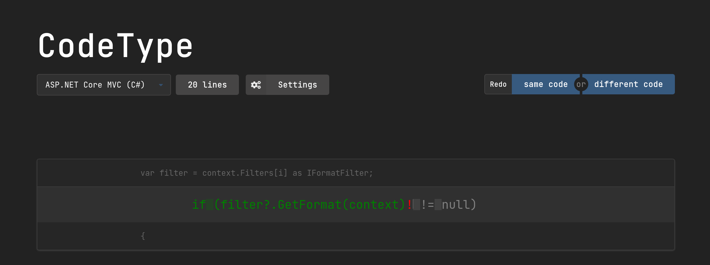

# CodeType

A typing test for programmers

## About
CodeType is a test that measures how fast you type. Instead of using random words or passages from books, CodeType uses code from GitHub repos. 

## Code sources
CodeType allows you to pick between these code sources:
- Flask (Python)
- ASP.NET Core MVC (C#)
- Linux kernel (C)
- QMK firmware (C)
- Express (JS)

If there's a source you would like to see added, file an issue and I'll add it.

## Credits
Here's a list of open source projects I used:
- [JetBrains Mono font](https://www.jetbrains.com/lp/mono/)
- [Fomantic-UI](https://github.com/fomantic/Fomantic-UI)
- [AhmedEid3's Fomantic-UI dark theme](https://github.com/fomantic/Fomantic-UI/pull/1436)
- [Newtonsoft.Json](https://github.com/JamesNK/Newtonsoft.Json)
- [Blazor WebAssembly](https://dotnet.microsoft.com/apps/aspnet/web-apps/blazor)
